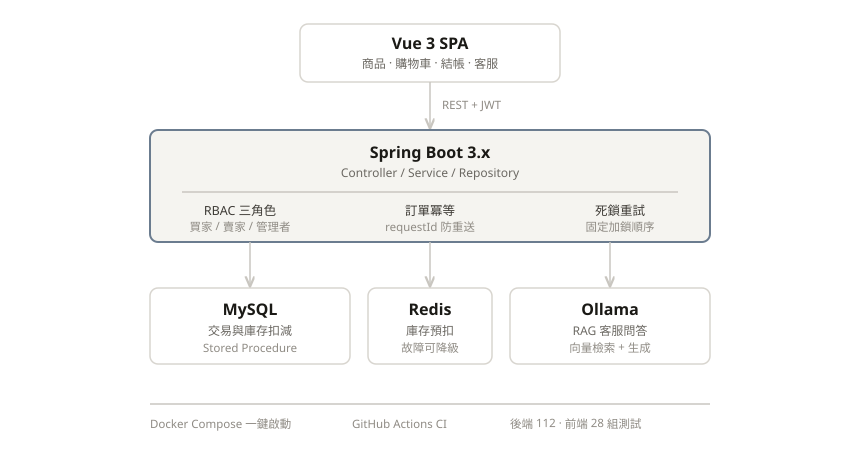

# ESUN Shopping Demo

[](https://github.com/WhiteHot0321/esun-shopping-demo/actions/workflows/ci.yml)

本專案依照玉山銀行 Java 後端實作題需求，提供一個簡易電商購物中心系統，包含：

- 新增商品
- 顯示庫存大於 0 的商品
- 建立訂單
- 更新商品庫存
- 使用 Stored Procedure
- 使用 Transaction 確保下單一致性
- Vue.js 前後端整合

---

## 專案結構

```
esun-shopping/
├─ backend/
│  ├─ src/main/java/com/esun/shop/
│  ├─ src/main/resources/application.yml
│  ├─ DB/
│  │  ├─ 01_schema.sql
│  │  ├─ 02_data.sql
│  │  └─ 03_stored_procedures.sql
│  └─ pom.xml
├─ frontend/
│  ├─ src/
│  ├─ package.json
│  └─ vite.config.js
└─ README.md
```

---

## 技術棧

Frontend  
- Vue 3  
- Vite  

Backend  
- Spring Boot 3  
- Spring JDBC  
- Bean Validation  

Database  
- MySQL 8  
- Stored Procedure  

Build Tool  
- Maven  
- npm  

---

## 系統功能

### 商品功能
- 新增商品
- 查詢庫存大於 0 商品
- 庫存管理

### 訂單功能
- 多商品訂單
- 自動計算小計與總價
- 建立訂單（編號格式 `Ms` + 毫秒級時間戳 + 6 碼隨機英數，例如 `Ms20260829101514222FWFTQW`）
- 扣減庫存
- Transaction 保證一致性

### 會員與認證
- JWT 認證（BCrypt 密碼雜湊）
- 忘記密碼與密碼重設
- BUYER / SELLER / ADMIN 三角色權限控制
- 收件地址簿與個人資料編輯

### 購物車與結帳
- 購物車持久化（MySQL 後端存儲）
- 訂單冪等性（requestId 防重送）
- 死鎖重試（固定加鎖順序）
- Redis 庫存預扣（故障時自動降級為 DB only）

### 商品評論
- 買家評論與評分
- 資料庫層保證一人一評
- 賣家與管理者審核功能

---

## 系統架構



**核心設計**：
- **Frontend**：Vue 3 SPA，透過 REST + JWT 呼叫後端
- **Backend**：Spring Boot 3.x 三層式架構，RBAC 角色權限、訂單冪等防重送、死鎖自動重試
- **Data**：MySQL（交易與庫存）、Redis（庫存預扣 + 故障降級）、Ollama（RAG 客服問答）
- **CI/CD**：Docker Compose 一鍵啟動、GitHub Actions 自動測試與構建

---

## API

### 互動式 API 文件（Swagger UI / OpenAPI）

後端啟動後（預設 `http://localhost:8080`）：

| 網址 | 內容 |
|------|------|
| `/swagger-ui.html` | Swagger UI：依模組分組（認證、商品、訂單、付款…），可直接試打 |
| `/v3/api-docs` | OpenAPI 3 JSON（`/v3/api-docs.yaml` 為 YAML），可匯入 Postman / 產生 client |

- 文件由 Controller 上的 `@Tag` / `@Operation` 與 Spring MVC 對應自動產生，改 API 後重啟即更新，不需另外維護文件。
- 需要登入的 API 已標上鎖頭：先 `POST /api/auth/login` 取得 token，按右上角 **Authorize** 貼上（不必加 `Bearer`）。公開路由的判定與 `JwtAuthFilter` 共用同一份規則，文件不會與實際驗證漂移。
- 角色限制（BUYER / SELLER / ADMIN）寫在每個 API 的摘要中；實際檢查仍在後端 Controller。
- **正式環境請設 `API_DOCS_ENABLED=false`**：文件端點會直接回 404（預設為開啟，方便本機開發）。

### 新增商品
POST /api/products

```json
{
  "productId": "P004",
  "productName": "藍牙耳機",
  "price": 1990,
  "quantity": 10
}
```

---

### 查詢可購買商品
GET /api/products/available

---

### 建立訂單
POST /api/orders

```json
{
  "requestId": "550e8400-e29b-41d4-a716-446655440000",
  "memberId": "1001",
  "payStatus": "PAID",
  "items": [
    {
      "productId": "P002",
      "quantity": 2
    },
    {
      "productId": "P003",
      "quantity": 1
    }
  ]
}
```

`requestId` 必須是小寫 canonical UUID。前端同一次結帳的網路或 HTTP 失敗重試時，請保留完全相同的 request payload 與 `requestId`；若訂單已建立，重試會以 HTTP 200 回傳原本的 `orderId`，不會再次扣庫存。若結帳結果未確認，修改購物車內容前應先使用原本的 payload 與 `requestId` 重試並確認結果；系統目前沒有登入驗證，僅會阻擋同一 requestId 被其他 memberId 使用。

---

## 本機執行方式

### 1. 建立資料庫

先安裝 MySQL，建立 schema：

```sql
CREATE DATABASE esun_shop;
```

依序執行：

- backend/DB/01_schema.sql
- backend/DB/02_data.sql
- backend/DB/03_stored_procedures.sql

既有資料庫請另外執行一次可追加的 migration `backend/DB/04_add_order_request.sql`，不要重新執行會刪除資料表的 `01_schema.sql`。以下命令適用於 Bash／Git Bash（PowerShell 不支援此處的 `<` shell 輸入重導向）。使用目前 Docker Compose 的 `mysql` service 時，可在專案根目錄執行：

```bash
docker compose exec -T mysql mysql -uroot -p"${DB_PASSWORD:-123456}" esun_shop < backend/DB/04_add_order_request.sql
```

也可直接連線到 MySQL 執行：

```bash
mysql -h localhost -P "${DB_PORT:-3306}" -uroot -p"${DB_PASSWORD:-123456}" esun_shop < backend/DB/04_add_order_request.sql
```

---

### 2. 設定資料庫連線

資料庫連線設定（port、帳號、密碼）已改為讀取環境變數，`docker-compose.yml` 與 `application.yml` 共用同一份設定，避免兩邊設定不一致。

複製環境變數範本並依需要調整：

```bash
cp .env.example .env
```

`.env` 內容：

```
DB_NAME=esun_shop
DB_PASSWORD=123456
DB_PORT=3306
DB_HOST=localhost
DB_USERNAME=root
SERVER_PORT=8080
```

`.env` 已列入 `.gitignore`，不會被提交，可自行填入本機密碼。

若用 Docker 啟動 MySQL，`docker compose` 會自動讀取根目錄的 `.env`：

```bash
docker compose up -d
```

> ⚠️ **Spring Boot 不會自動讀取 `.env`。** 若後端不透過 Docker、直接用 `mvn` 或 IDE 啟動，必須先把 `.env` 匯出成環境變數（做法見下方「3. 啟動後端」），否則會套用 `application.yml` 中的預設值（`localhost:3306`、`root`、`123456`）。
>
> 若你的 `.env` 改過 `DB_PORT`（例如本機 3306 已被原生 MySQL 佔用，改用 3310），漏了這一步後端就會連到錯誤的資料庫，前端會顯示「商品載入失敗」、「資料庫操作失敗」，請見 [常見問題](#常見問題)。

---

### 3. 啟動後端

先把 `.env` 匯出成環境變數，**再**啟動後端（環境變數只對當前終端機生效，每開一個新終端機都要重做一次）。

PowerShell：

```powershell
Get-Content .env | Where-Object { $_ -match '^\s*[^#\s][^=]*=' } | ForEach-Object { $k,$v = $_ -split '=',2; Set-Item "env:$($k.Trim())" $v.Trim() }
cd backend
mvn spring-boot:run
```

Bash／Git Bash：

```bash
set -a; source .env; set +a
cd backend
mvn spring-boot:run
```

或打包後執行（同樣要先匯出環境變數）：

```bash
cd backend
mvn clean package
java -jar target/shopping-backend-1.0.0.jar
```

用 IDE 啟動時，改在 Run Configuration 的環境變數中設定 `.env` 的內容（至少 `DB_PORT`、`DB_PASSWORD`）。

後端預設：

http://localhost:8080

---

### 4. 啟動前端

```bash
cd frontend
npm install
npm run dev
```

前端預設：

http://localhost:5173

---

### 常見問題

**前端一開就顯示「商品載入失敗」／「資料庫操作失敗」**

前端能開、但商品列表、收件地址、推薦都載入失敗（`GET /api/products/available` 回 500），通常是後端與資料庫沒接對，依序檢查：

1. **後端連錯資料庫**：沒有匯出 `.env` 就啟動，後端會套用預設值 `localhost:3306`。若本機 3306 被原生 MySQL 佔用（Docker 的 MySQL 在 `.env` 指定的其他埠，如 3310），會因帳密不符連線失敗。解法：依「3. 啟動後端」匯出 `.env` 後重啟。
2. **資料庫 schema 落後**：後端日誌出現 `Table 'esun_shop.xxx' doesn't exist`，代表既有資料庫缺新版本的資料表。請依序執行 `backend/DB/` 下編號較新的 migration（`06_member_profile.sql` 之後皆可重複執行）。**不要**對既有資料庫重跑 `01_schema.sql`、`04_member.sql`、`05_password_reset_token.sql`，它們會先 `DROP TABLE` 清掉資料。

---

## 測試方式

可透過前端畫面測試以下功能：

- 查詢商品列表
- 新增商品
- 建立單商品訂單
- 建立多商品訂單
- 驗證庫存扣減
- 驗證庫存不足交易回滾

---

## Transaction 說明

建立訂單流程：

1. 建立訂單主檔
2. 建立訂單明細
3. 扣減商品庫存

若任一流程失敗，透過 `@Transactional` 自動 rollback，確保資料一致性。

---

## Stored Procedure

使用 Stored Procedure：

- sp_add_product
- sp_get_available_products
- sp_decrease_stock

---

## 安全性說明

SQL Injection  
- 使用 JdbcTemplate / SimpleJdbcCall  
- 所有查詢採參數化方式  
- 未使用動態 SQL 字串拼接  

XSS  
- 後端對商品名稱進行 HTML escape  
- 前端使用 Vue template rendering  
- 未使用 v-html 直接渲染輸入資料  

Transaction  
- 建立訂單使用 @Transactional  
- 避免多表異動資料不一致  

---

## 三層式架構

- Controller  
- Service  
- Repository  

分離業務邏輯與資料存取。

---

## 重置測試資料

若測試後資料被修改，可依序重新執行：

backend/DB/01_schema.sql
backend/DB/02_data.sql

`01_schema.sql` 會先 DROP 既有資料表再重建，`02_data.sql` 會重新寫入初始測試資料，
兩者依序執行即可還原初始測試資料，無需額外的 reset.sql。

---

## 商品 AI 客服（RAG）

新增一個唯讀的「商品 AI 客服」功能：使用者以自然語言提問 → 系統用 RAG 從商品與常見問答中檢索相關資料 → LLM 根據檢索到的資料回答，並附上引用來源。預設使用本機 Ollama（免費、離線可用），介面設計成之後可平滑切換為 Claude API。

### 啟動 Ollama 並下載模型

```bash
docker-compose up ollama   # 或本機安裝：ollama serve

docker exec esun-ollama ollama pull llama3.1
docker exec esun-ollama ollama pull nomic-embed-text

# 確認模型已就緒
curl -s http://localhost:11434/api/tags
```

後端啟動時（`EmbeddingIndexRunner`）會自動掃描 `product` 與 `faq` 資料表，為尚未建立、或來源資料已更新的項目呼叫 embedding API 並寫入 `doc_embedding` 表；若 Ollama 尚未啟動，索引會略過並記錄警告，不影響其餘功能正常啟動。

### API 範例

```
POST /api/support/ask
{
  "question": "有沒有防水的商品？"
}
```

```json
{
  "success": true,
  "data": {
    "answer": "根據目前商品資料……",
    "sources": [
      { "sourceType": "product", "sourceId": "P003", "title": "真愛密碼項鍊", "similarity": 0.87 }
    ]
  }
}
```

錯誤情境：問題為空或超過 500 字 → 400；Ollama 無法連線或逾時 → 503；切換為 Claude 但尚未實作 → 501。

### 切換為 Claude API

修改 `backend/src/main/resources/application.yml`（或設定環境變數）：

```yaml
llm:
  provider: claude   # 或設定環境變數 LLM_PROVIDER=claude
```

並設定環境變數 `ANTHROPIC_API_KEY`。目前 `ClaudeLlmClient` 僅為框架 stub（尚未實作實際呼叫），呼叫客服 API 會回傳 501，待後續階段補上實作。

**尚未涵蓋（留待後續階段）**：`ClaudeLlmClient` 的實際呼叫實作、多輪對話記憶、串流回應（SSE）、速率限制、token 用量監控。

---

## 題目需求對應

- 使用 Vue.js：已完成
- 使用 Spring Boot：已完成
- RESTful API：已完成
- 使用 Maven：已完成
- Stored Procedure：已完成
- Transaction：已完成
- DDL / DML 放 DB 資料夾：已完成
- SQL Injection 防護：已完成
- XSS 防護：已完成
