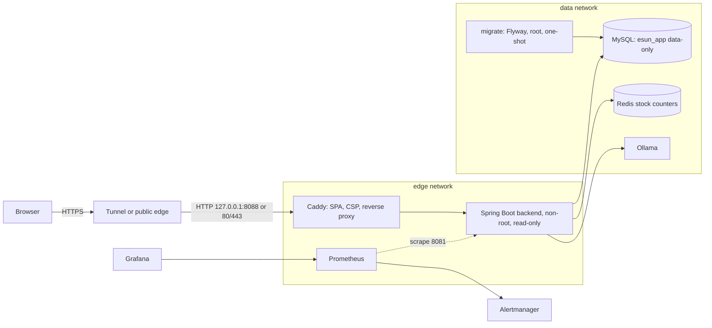

# 067 — Phase 3.3 closeout: what is proven, what is not, and what happens next

Date: 2026-09-29 (Asia/Taipei). Executor: Claude Code. Branch: `advanced-v2`. This is the #22 deliverable in the form that is possible without a VM, a stable public URL or ECPay production access.
It is a status record first and a portfolio narrative second: every claim below points at evidence in the repository.

## Status of Phase 3.3

| # | Item | Proven (evidence) | Still open | Needs |
|---|---|---|---|---|
| 18 | Production topology and deployment | B1 hardening, B2 Compose/Caddy/frontend image/non-root, local-stack acceptance and a real `cloudflared` public-HTTPS smoke (060); Flyway adoption spike (053) | **B3 deploy pipeline** (Actions deploy job, environment approval, backup-before-deploy, health gate, rollback) and a stable public URL; VM bootstrap script written but never run on a host | A VM (or a stable tunnel plus a decision to drop B3) |
| 19 | Observability and alerting | Prometheus endpoint on the management port only, correlation ids, JSON logs, 5 business counters + lock/Redis signals, Prometheus/Alertmanager/Grafana overlay, 11 alert rules **all unit-tested**, a live `BackendDown` fire and recovery (061), runbook (`docs/runbook-incident.md`) | Notification delivery (no destination), Ollama connectivity metric, tuned thresholds, log/metric export | A safe alert destination |
| 20 | SQL performance | 47 query shapes captured repeatably, one accepted change with a measured 2.6x gain, five rejected with numbers, capacity model, regression check (062) | Application-level load re-run, lock-duration/pool measurements, **owner decision on the public recommendation endpoints (~0.5 s DB CPU per call)** | The decision (cache / roll-up / window / rate limit) |
| 21 | Production security | Supply-chain gate on the runner (fixture self-test, repo scan, image scan, digest scan, SBOM + provenance, config validation) with real findings fixed (frontend deps; **41 backend findings via Spring Boot 3.5.16**), CSP/headers, capability drops, read-only backend, network segmentation, data-only DB user, redacted rotation drill, encrypted backups with restore drill (063-066) | Host firewall, SSH policy, TLS chain/renewal, external port scan, **off-host backup and recovery from it**, RPO/RTO, backup scheduling | A VM and an off-host storage account |
| 22 | Go-live acceptance | This document; public HTTPS smoke through a quick tunnel (060) | **Real ECPay inbound callback**, stable-URL smoke, non-destructive production acceptance, measured production performance | Tailscale Funnel or a VM, ECPay stage merchant values, a person completing the stage payment |

Independent review: a fresh-context, read-only Claude review (not Codex) covered #18-#21 after implementation; its 12 findings were fixed or recorded (see `docs/tasks/061`-`066`,
`065` for the CI failure it helped explain). No Codex review took place, so the Critical-risk items (#18, #21) have the one review the project rules require, from the same model family as the author.

Tests at close: backend `mvn clean test` 307/307 with JaCoCo gates met (also 307/307 in a Linux/Java 17 container); Vitest 83/83; `promtool test rules` all cases; GitHub Actions run #100 green on all six jobs.

## Architecture

Only Caddy publishes a port (loopback in tunnel mode). The backend never holds DDL credentials; the management port is unpublished; images are scanned and published with SBOM/provenance.

## Failure stories worth telling

1. **A production default that made restocks silently ineffective.** With the Redis stock path on (the B2 default), a sold-out product stayed unsellable after a restock, and any product created after startup
   latched the service to DB-only mode. Unit and integration tests had not covered it because they seeded Redis directly; it appeared only when the deployed topology was exercised end to end. Fixed with after-commit
   sync, a real-Redis test and a mutation check (065).
2. **The supply-chain gate found the backend on an unsupported Spring Boot.** 41 fixable HIGH/CRITICAL findings (Tomcat, Netty, Spring). The fix was a framework upgrade verified by the whole suite, not a suppression (063).
3. **A CI failure that could not be reproduced locally** turned out to be a test whose passing depended on class order (a global CHECK over a shared audit table). Finding it required making CI publish failures as
   annotations; the fix was to scope the test's constraint (065).
4. **Measured-and-rejected optimisations.** An index plus hint made the typical seller page 3x faster but a seller with no orders 3000x slower (0.04 ms to 117 ms); it was not shipped (062).
5. **A healthcheck that reported "unhealthy" for an optional dependency**: the aggregate health endpoint included Ollama; the container now follows readiness (060).

## What to do next (in order)

1. Decide how the app is reached publicly: personal Tailscale account (Funnel) or a VM. Without one, #18 B3, #21 host checks and #22 stay open.
2. Decide the recommendation-endpoint mitigation (062) — the largest remaining capacity and abuse risk.
3. Configure a real alert destination and an off-host backup target; run the drills against them.
4. Run the real ECPay stage payment once the callback URL is public, and record the inbound callback.
5. Review the observation in 065 (a review can be posted after a cancelled order) and the open Redis-sync races.

## Public smoke through Tailscale Funnel (2026-09-29, Asia/Taipei)

Executor: Claude Code. Setup: personal-account Tailscale, Funnel enabled by the owner, `tailscale funnel --bg 8088` -> Caddy on `127.0.0.1:8088` (tunnel mode, `docker-compose.tunnel.yml`). Stack recreated with fresh volumes, newly generated random secrets in the git-ignored `.env.prod`, `CORS_ALLOWED_ORIGINS` set to the Funnel origin, `PAYMENT_PROVIDER=none`. The hostname is intentionally not recorded here.

| Check | Result |
|---|---|
| Stack health | mysql, redis, backend (healthy), caddy, ollama up; Flyway v1 applied |
| `GET /` and `/assets/*` via Funnel | 200, HTML/JS/CSS served |
| Headless browser (Playwright) on Funnel URL | SPA renders, console 0 errors, in-page `GET /api/products/available` 200 |
| `GET /api/products/available` | 200 without auth (empty list: fresh DB, no seed data) |
| `POST /api/auth/register` + login | success |
| `/actuator/health` via Funnel | returns the SPA fallback, i.e. not exposed publicly |

Notes: the task brief named `GET /api/products` as a public endpoint; that route is POST-only (405) and product listing is `/api/products/available`. The embedded Claude browser pane blocked the page's sub-resources (`ERR_BLOCKED_BY_CLIENT`, a client-side restriction; curl and Playwright load them fine).

Not covered: real ECPay stage payment and inbound callback, load, long-running stability, off-host backup, independent review of this acceptance. Stage stays below "complete".
